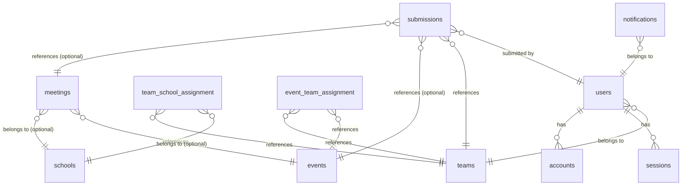
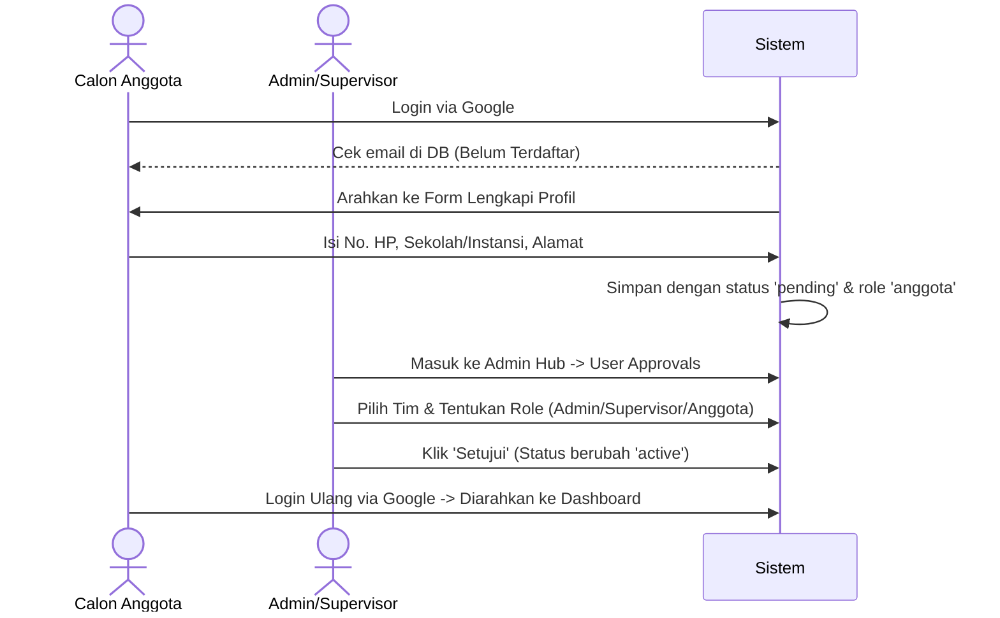
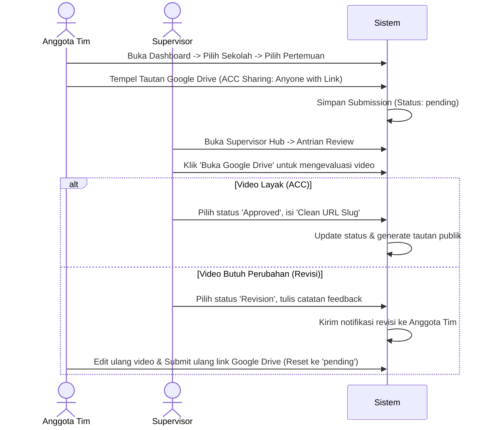

# Analisis & Dokumentasi Teknis Sistem - RoboEdu Studio QC Hub

Dokumen ini berisi analisis lengkap dan dokumentasi teknis dari website **RoboEdu Studio Quality Control (QC) Hub**, platform manajemen alur kerja, pemantauan progres, dan kendali mutu (quality control) produksi video edukasi robotika.

---

## 1. Ikhtisar Sistem (System Overview)
RoboEdu Studio QC Hub dirancang untuk mengelola alur kerja tim kreatif yang memproduksi konten video edukasi untuk sekolah mitra. Sistem ini berfokus pada efisiensi dengan menyederhanakan proses pengumpulan video melalui tautan Google Drive (tanpa unggahan file video langsung ke server) dan mengotomatiskan proses evaluasi oleh Supervisor QC hingga menghasilkan Clean URL publik yang siap dibagikan ke klien.

### Fitur Utama:
- **Autentikasi Ganda**: Login Google OAuth untuk Anggota Tim Kreatif (agar email terverifikasi) dan Credentials (Email & Password) untuk Admin/Supervisor.
- **Persetujuan Akses (Approval Queue)**: Pengguna baru harus disetujui oleh Admin dan ditempatkan di divisi/tim tertentu sebelum dapat mengakses dashboard.
- **Isolasi Workspace**: Anggota tim hanya dapat melihat sekolah dan event yang ditugaskan kepada tim mereka.
- **Hierarki Folder Bertingkat**: Struktur navigasi Sekolah -> Pertemuan/Minggu -> Submissions.
- **Kendali Mutu (QC Workflow)**: Alur evaluasi video oleh Supervisor untuk memutuskan status **ACC (Approved)** atau **Revisi** (dilengkapi catatan masukan).
- **Clean URL (Video Delivery)**: Pembuatan tautan publik yang representatif dan rapi untuk mendistribusikan video yang disetujui ke klien (sekolah/orang tua murid).
- **Bank Media Terintegrasi**: Tempat penyimpanan aset desain, logo, bumper, dan materi audio menggunakan Cloudinary.
- **Laporan Otomatis**: Generator statistik performa tim mingguan/bulanan yang dapat dicetak langsung ke PDF.

---

## 2. Arsitektur Teknologi (Tech Stack)

Sistem ini dibangun menggunakan arsitektur modern berbasis JavaScript/TypeScript:

| Komponen | Teknologi | Deskripsi |
| :--- | :--- | :--- |
| **Core Framework** | Next.js 16 (App Router) | Menggunakan Server Actions untuk logika backend dan optimalisasi routing dinamis. |
| **Bahasa Pemrograman**| TypeScript | Menjamin keamanan tipe data di seluruh modul database dan komponen. |
| **Database** | SQLite (LibSQL) | Database relasional ringan yang dikoneksikan via `@libsql/client`. |
| **ORM** | Drizzle ORM | Pemetaan database tipe-aman (type-safe queries) dan skema deklaratif. |
| **Autentikasi** | NextAuth.js v5 (Auth.js) | Penanganan JWT Session, Google Provider, dan Credentials Provider. |
| **Penyimpanan Media** | Cloudinary | Host eksternal untuk aset statis agar menghemat penyimpanan server lokal. |
| **Styling & UI** | TailwindCSS v4 & Phosphor Icons | Mengimplementasikan desain modern, glassmorphism, dan tema terang/gelap (`next-themes`). |
| **Visualisasi Data** | Recharts | Render grafik kinerja tim pada dashboard utama. |

---

## 3. Skema Database (Database Schema)

Sistem menggunakan SQLite dengan relasi yang didefinisikan dalam `src/db/schema.ts`. Berikut adalah visualisasi dan penjelasan tabel-tabel utama:

### Detail Deskripsi Tabel:

1. **`users`**: Menyimpan data pengguna (anggota, supervisor, admin).
   - Kolom kunci: `id`, `name`, `email`, `role` (anggota, supervisor, admin), `teamId`, `status` (pending, active, rejected), `phone`, `institution`, `address`.
2. **`teams`**: Daftar tim/divisi kreatif (misalnya: Tim Sosmed, Tim Ekskul, dll.).
   - Kolom: `id`, `name`, `description`.
3. **`schools`**: Daftar sekolah mitra yang bekerjasama dengan RoboEdu.
   - Kolom: `id`, `name`, `address`, `contactPerson`, `contactPhone`.
4. **`team_school_assignment`**: Menghubungkan Tim ke Sekolah (banyak-ke-banyak). Memastikan isolasi data.
5. **`events`**: Proyek khusus selain sekolah rutin (seperti Kompetisi, Pameran).
6. **`event_team_assignment`**: Menghubungkan Tim ke Proyek Event.
7. **`meetings`**: Sub-folder atau progres mingguan dalam Sekolah atau Event (misalnya: "Pertemuan 1", "Minggu 1").
8. **`submissions`**: Tempat penyimpanan data pengumpulan tugas.
   - Kolom: `id`, `meetingId`, `eventId`, `teamId`, `submittedBy`, `driveLink`, `status` (pending, approved, revision), `feedback` (catatan revisi), `reviewedBy`, `cleanUrlSlug` (slug URL publik).
9. **`assets`**: Menyimpan aset mentahan produksi yang diupload ke Cloudinary.
10. **`reports`**: Riwayat ekspor/laporan kinerja tim.
11. **`notifications`**: Notifikasi internal sistem untuk revisi, persetujuan user, atau tugas baru.

---

## 4. Alur Kerja Utama (Core Workflows)

### A. Alur Registrasi & Verifikasi Pengguna

### B. Alur Pengumpulan Video & Kendali Mutu (QC)

### C. Alur Distribusi Video ke Klien (Clean URL)
Ketika status submission disetujui (`approved`) dan diberikan slug (misalnya `sd1-pertemuan1`), sistem akan merender halaman publik dinamis di `/sd1-pertemuan1`.
- Halaman ini dapat diakses tanpa login.
- Menyediakan pemutar video (iframe preview Google Drive).
- Menyediakan tombol "Unduh Resolusi Asli" (konversi link Drive ke tautan unduhan langsung).
- Tombol "Bagikan" untuk menyalin link ke WhatsApp.

---

## 5. Matriks Peran & Hak Akses (Role-Based Access Control)

Sistem membedakan hak akses berdasarkan kolom `role` pada tabel `users`:

| Fitur / Modul | Admin / Direktur / Manager | Supervisor QC | Anggota (Tim Kreatif) | Publik / Klien |
| :--- | :---: | :---: | :---: | :---: |
| **Akses Dashboard Utama** | Ya | Ya | Ya | Tidak |
| **Bypass Peran (God Mode)**| Ya | Tidak | Tidak | Tidak |
| **Manajemen Tim & Sekolah**| Ya | Tidak | Tidak | Tidak |
| **Persetujuan User Baru** | Ya | Tidak | Tidak | Tidak |
| **Unggah Media Bank** | Ya | Ya | Lihat Saja | Tidak |
| **Membuat Pertemuan Baru** | Ya | Ya | Tidak | Tidak |
| **Submit Tautan Google Drive**| Tidak | Tidak | Ya (Hanya Tim Sendiri) | Tidak |
| **Review & Beri Status QC** | Ya | Ya | Tidak | Tidak |
| **Generate Laporan Kinerja**| Ya | Ya | Tidak | Tidak |
| **Menonton Video TerACC** | Ya | Ya | Ya | Ya (Via Clean URL) |

---

## 6. Mekanisme God Mode (All Access Control)

Untuk memudahkan pengembangan dan presentasi produk tanpa harus bergonta-ganti akun Google nyata, sistem dilengkapi dengan fitur **God Mode**:
- Diaktifkan melalui tombol melayang gir (`Gear`) di pojok kanan bawah halaman.
- Logika otentikasi di `src/lib/auth.ts` memeriksa keberadaan cookie `god_mode_role` dan `god_mode_team`.
- Jika cookie aktif, sistem secara otomatis membypass alur NextAuth dan memberikan identitas simulasi (misalnya: login sebagai Admin, Supervisor, atau Anggota dari tim spesifik).
- Fitur ini mempermudah demonstrasi alur kerja QC lintas peran secara real-time.
